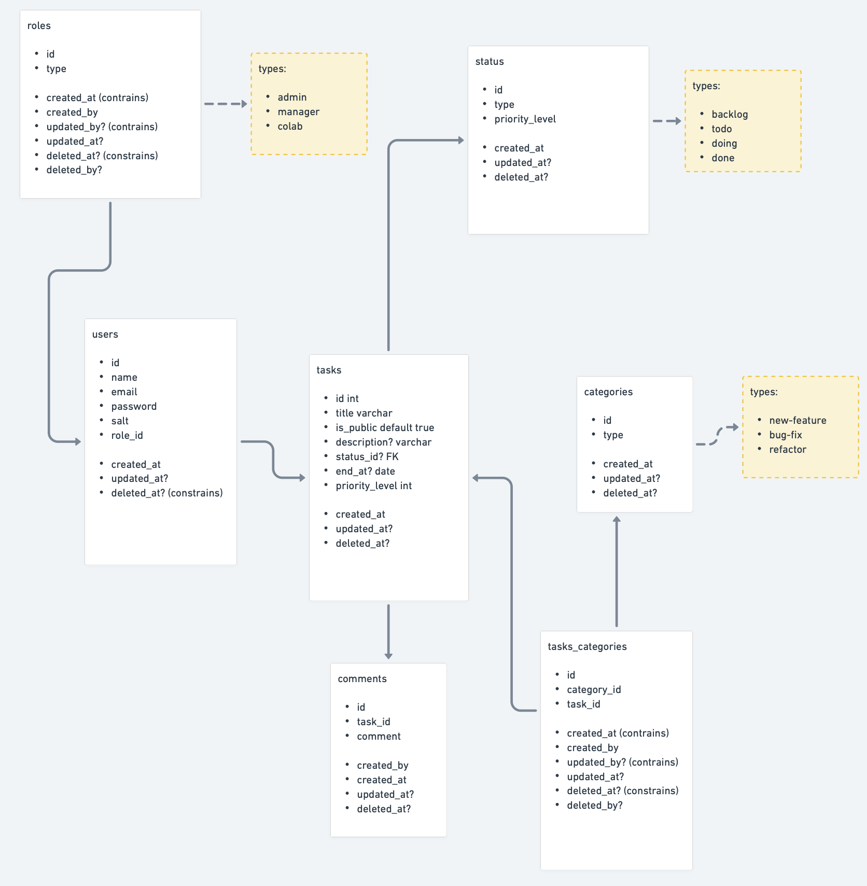
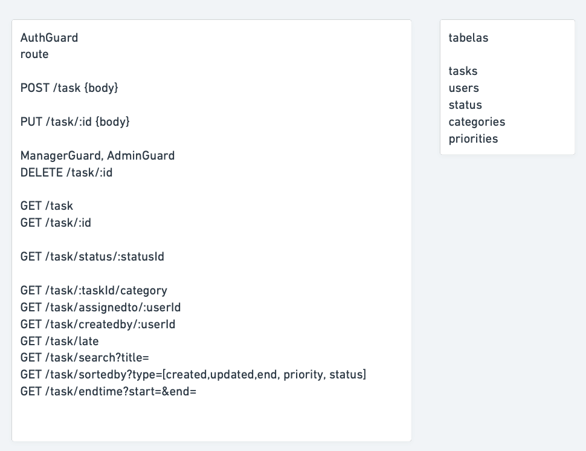
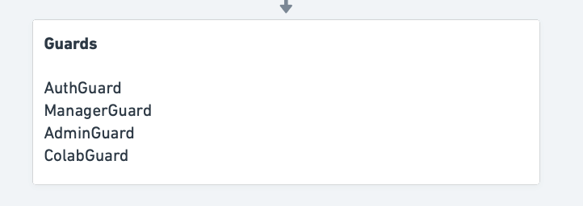

<p align="center">
  <a href="http://nestjs.com/" target="blank"></a>
</p>

[circleci-image]: https://img.shields.io/circleci/build/github/nestjs/nest/master?token=abc123def456
[circleci-url]: https://circleci.com/gh/nestjs/nest

  <p align="center">A progressive <a href="http://nodejs.org" target="_blank">Node.js</a> framework for building efficient and scalable server-side applications.</p>
    <p align="center">
<a href="https://www.npmjs.com/~nestjscore" target="_blank"></a>
<a href="https://www.npmjs.com/~nestjscore" target="_blank"></a>
<a href="https://www.npmjs.com/~nestjscore" target="_blank"></a>
<a href="https://circleci.com/gh/nestjs/nest" target="_blank"></a>
<a href="https://coveralls.io/github/nestjs/nest?branch=master" target="_blank"></a>
<a href="https://discord.gg/G7Qnnhy" target="_blank"></a>
<a href="https://opencollective.com/nest#backer" target="_blank"></a>
<a href="https://opencollective.com/nest#sponsor" target="_blank"></a>
  <a href="https://paypal.me/kamilmysliwiec" target="_blank"></a>
    <a href="https://opencollective.com/nest#sponsor"  target="_blank"></a>
  <a href="https://twitter.com/nestframework" target="_blank"></a>
</p>
  <!--[](https://opencollective.com/nest#backer)
  [](https://opencollective.com/nest#sponsor)-->

## Description

[Nest](https://github.com/nestjs/nest) framework TypeScript starter repository.

## Installation

What am I using?
> node
> nest
> typeorm com drive postgres
> docker com imagem postgres

```bash
$ npm install
```

## Running the app
To connect the database, you need to run the docker application. Inside the repository folder, run the following command

```bash
# pull image database and settings
$ docker-compose up    
```

```bash
# development
$ npm run start

# watch mode
$ npm run start:dev

# production mode
$ npm run start:prod
```

## Project Description

Project Kanban is a web application for task management that allows users to create, assign, update, and track task progress. It was developed using the NestJS framework and PostgreSQL database.

### Entity Definition and Database Modeling

The project includes the following entities and their descriptions:



- **User**: Represents application users. Each user has a name, email, encrypted password, role, and other related information.
- **Task**: Represents tasks that can be created and managed by users. Each task has a title, description, status, end date, and priority.
- **Category**: Represents categories to which tasks can be assigned. Each category has a name and can be associated with multiple tasks.
- **Status**: Represents possible states of a task, such as "In Progress" or "Completed."

Could implement
- **Priority**: Represents priority levels that can be assigned to a task, such as "High," "Medium," or "Low."

The database modeling reflects these entities and their relationships.

### Route Definitions

The application offers the following routes according to the entities, for example, to task endpoints:


- `POST /task`: Creates a new task.
- `PUT /task/:id`: Updates an existing task.
- `DELETE /task/:id`: Deletes a task.
- `GET /task`: Returns the list of all tasks.
- `GET /task/:id`: Returns details of a specific task.

I took the following workflow to develop the endpoints



### Guard Definitions

To protect routes and control access, the project uses the following guards:

- `AuthGuard`: Ensures that the user is authenticated to access protected routes.

Could Implement
- `AdminGuard`: Restricts access to administrative and user management functionalities to administrators.

I took the following workflow to develop the database



### Role Definitions

The system has three different roles:

- **Administrator (Admin)**: Has full access to administrative and user management functionalities.
- **Collaborator (Colab)**: Has basic access to create, edit, and manage tasks assigned to themselves.

## License

Nest is [MIT licensed](LICENSE).
